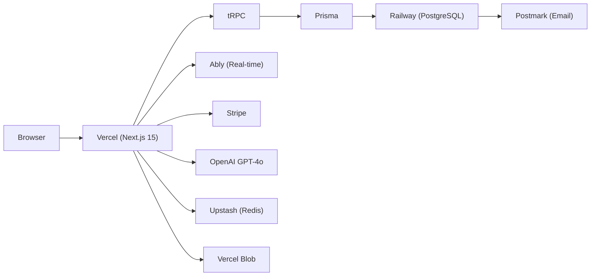

# Vibe Brain — TaskFlow
> Last compiled: 2026-03-15 14:30 PST
> Brain version: 6
> Compression count: 5
> Brain score: 92/100 (Fresh · 95% complete · 3.2:1 compression)
> Total sessions: 47
> Brain schema: v3.2

## Identity
- **Name**: TaskFlow
- **One-liner**: Team task management app with real-time collaboration and AI summaries
- **Stage**: Beta
- **Repo**: github.com/example/taskflow
- **Live URL**: app.taskflow.dev
- **Package Manager**: npm

## User Preferences
- Prefers concise, direct responses — no filler or hedging
- Suggests commit after every completed task
- Design standard: Linear/Notion tier — clean, fast, minimal
- Uses VS Code with Prettier + ESLint
- Runs `npm test` before every PR
- Delegates database migrations — provides SQL scripts with instructions
- Wants thread tracking for multi-session work

## Active Context
Migrating real-time from Vercel KV to Ably. KV pub/sub confirmed ~2s latency —
unacceptable for Kanban. Ably prototype next. After real-time fix: notifications system.

## Active Threads

### [THREAD-1] Real-time migration: Vercel KV → Ably
- **Status**: in-progress
- **Context**: 2s latency on KV pub/sub. Ably offers sub-100ms + presence.
- **Files**: lib/realtime.ts, hooks/useRealtimeTasks.ts
- **Last action**: Benchmarked KV latency, confirmed problem
- **Next step**: Prototype Ably integration, compare latency

### [THREAD-2] Notifications system design
- **Status**: parked
- **Context**: User wants in-app + email digest. Waiting on real-time fix first.
- **Next step**: Design notification schema after Ably migration

## Tech Stack
- **Frontend**: Next.js 15, TypeScript, Tailwind CSS 4, shadcn/ui
- **Backend**: Node.js + Prisma ORM, PostgreSQL on Railway
- **Auth**: NextAuth.js (Google OAuth + email magic links)
- **Payments**: Stripe ($19/mo starter, $49/mo pro, 14-day trial)
- **Email**: Postmark (transactional)
- **AI/ML**: OpenAI GPT-4o (task summarization, auto-labeling)
- **Infra**: Vercel (frontend), Railway (DB + cron jobs), Upstash Redis (rate limiting)
- **Key Libraries**: Zustand, TanStack Query, tRPC, Tiptap editor, Framer Motion, Recharts

## Architecture
- Next.js App Router with RSC for marketing, client components for app
- tRPC for type-safe client-server communication — no REST endpoints
- Prisma ORM with PostgreSQL on Railway. All queries workspace-scoped
- NextAuth.js sessions (JWT strategy + database adapter)
- Upstash Redis for rate limiting on AI endpoints + auth attempts
- Real-time: migrating from Vercel KV to Ably for sub-100ms updates
- File storage: Vercel Blob (task attachments, avatars)

## Architecture Diagram

## Directory Map
- `app/(marketing)/` — 8 marketing pages (SSG)
- `app/(app)/` — 15 app routes (dashboard, projects, tasks, settings, billing)
- `components/` — 95 React components
- `server/` — tRPC routers, Prisma client, AI helpers
- `prisma/` — schema + 34 migrations
- `lib/` — 12 utility modules
- `emails/` — 6 React Email templates

## Database Schema

**Auth & Tenancy**
- `User` (id, name, email, image, role [owner|admin|member], workspaceId FK→Workspace)
- `Workspace` (id, name, slug, plan [free|starter|pro], stripeCustomerId, stripeSubscriptionId, trialEnd, createdAt)
- `Invitation` (id, workspaceId FK, email, role, status [pending|accepted|expired], token, expiresAt)
- `Session` / `Account` / `VerificationToken` — NextAuth standard tables

**Core**
- `Project` (id, workspaceId FK, name, description, color, status [active|archived], createdBy FK→User)
- `Task` (id, projectId FK, workspaceId FK, title, description, status [todo|in_progress|review|done], priority [low|medium|high|urgent], assigneeId FK→User, dueDate, position, parentId FK→Task)
- `Comment` (id, taskId FK, authorId FK→User, content, createdAt)
- `Label` (id, workspaceId FK, name, color)
- `TaskLabel` (taskId FK, labelId FK)
- `Attachment` (id, taskId FK, name, url, size, uploadedBy FK→User)

**Collaboration**
- `Document` (id, workspaceId FK, projectId FK, title, content JSON, createdBy FK→User)
- `Activity` (id, workspaceId FK, userId FK, action, targetType, targetId, metadata JSON)

**Billing**
- `BillingEvent` (id, workspaceId FK, eventType, stripeEventId, metadata JSON)

## API Surface
**tRPC Routers:**
- `workspace` → CRUD, settings, members, invitations
- `project` → CRUD, archive, templates
- `task` → CRUD, reorder, assign, bulk update, subtasks
- `comment` → CRUD on tasks
- `document` → CRUD with version history
- `label` → CRUD, assign/unassign
- `activity` → workspace feed, per-task timeline
- `billing` → create checkout, create portal, sync plan
- `ai` → summarize, suggest labels, generate description
- `user` → profile, preferences, avatar

**Webhooks:**
- `stripe` → checkout.session.completed, invoice.paid, subscription.updated/deleted, trial_will_end

**Cron Jobs (Railway):**
- `daily-digest` → email summary of yesterday
- `trial-reminder` → warning at day 7, 12, 14
- `stale-task-nudge` → flags tasks in-progress >7 days

## External Connections
- **Stripe** → payments + webhooks (checkout, invoices, subscription lifecycle)
- **Postmark** → transactional email (invites, welcome, digest, trial, password reset)
- **OpenAI** → GPT-4o (summarization, labeling, description generation)
- **Vercel** → frontend + serverless + Blob storage + KV
- **Railway** → PostgreSQL + cron runners
- **Upstash** → Redis rate limiting
- **Google** → OAuth provider
- **Ably** → real-time task updates (migration in progress)

## Environments
- **Dev**: localhost:3000 — local PostgreSQL, seed data, debug mode
- **Staging**: staging.taskflow.dev — auto-deploy from `develop` branch, Railway staging DB
- **Prod**: app.taskflow.dev — deploy from `main` via Vercel, Railway prod DB
- **Last deploy**: 2026-03-14 "Full-text search + keyboard shortcuts"

## Features — Current State
**Core App**
- ✅ Auth: Google OAuth + magic links, workspace creation, roles
- ✅ Projects: CRUD, archive, color coding, templates
- ✅ Tasks: Kanban, subtasks, assignments, due dates, priority, bulk update
- ✅ Labels: workspace-scoped, color-coded, multi-assign
- ✅ Comments: threaded with @mentions
- ✅ Documents: Tiptap editor with version history
- ✅ Activity feed: workspace-wide timeline
- ✅ Dashboard: burndown, workload, velocity charts
- ✅ Search: full-text (tasks + comments) with Cmd+K
- 🔨 Real-time updates: migrating from Vercel KV to Ably (latency fix)
- 📋 Notifications: in-app + email digest
- 📋 Mobile app: responsive web first, native later

**AI**
- ✅ Task summarization, label suggestion
- 🔨 Description generation: API done, UI in progress

**Billing**
- ✅ Stripe checkout, customer portal, trial lifecycle

**Marketing**
- ✅ Homepage, Features, Pricing, About, Contact, Privacy, Terms
- 📋 Blog, comparison pages

## Dependencies
- Billing → Auth (must be logged in)
- Tasks → Projects (task belongs to project)
- Comments → Tasks (comment belongs to task)
- Documents → Projects (document belongs to project)
- Labels → Workspace (labels are workspace-scoped)
- AI endpoints → Auth + rate limiting (Upstash)
- Real-time → Ably SDK + Auth (session token for presence)
- Search → Database (PostgreSQL tsvector index)
- Daily digest → Postmark + Activity feed (aggregates yesterday's Activity records)

## Key Decisions
- [2026-03-15] [DEEP] Ably over Vercel KV — Sub-100ms latency, built-in presence,
  generous free tier (6M msg/mo). Alternatives: Pusher (similar but 2x price),
  Socket.io (self-hosted, maintenance burden), Supabase Realtime (tied to their DB).
  Ably chosen for standalone WebSocket without DB coupling.
- [2026-03-10] tRPC over REST — full type safety, native Next.js integration
- [2026-03-05] [DEEP] Prisma over Drizzle — Better migration tooling, mature ecosystem,
  official Next.js integration. Alternatives: Drizzle (faster queries but immature
  migrations), Kysely (too low-level for rapid iteration), raw SQL (maintenance burden).
- [2026-03-01] Railway for DB — needed raw Prisma, not a hosted client SDK
- [2026-02-25] App Router over Pages — RSC for marketing SEO, server components for perf

## Anti-Patterns
- [2026-03-15] Tried Vercel KV for real-time → ~2s pub/sub latency, unusable for Kanban drag-and-drop
- [2026-03-05] Tried Drizzle ORM → migration tooling too immature, no rollback support, switched to Prisma
- [2026-02-28] Tried custom email renderer with MJML → too fragile, inconsistent across clients, switched to React Email
- [2026-02-20] Tried Zustand for server state → caused stale data issues, switched to TanStack Query for server state (Zustand kept for UI state only)

## Known Issues & Tech Debt
- [high] Real-time latency ~2s — `lib/realtime.ts` (migration in progress)
- [med] Kanban drag jitter on mobile Safari — `components/KanbanBoard.tsx`
- [low] Daily digest missing unsubscribe link — compliance risk
- [low] Search doesn't index document content — only task titles/descriptions

## Hot Paths
- `components/KanbanBoard.tsx` — 23 edits this month
- `server/routers/task.ts` — 18 edits
- `lib/realtime.ts` — 12 edits (active migration)
- `components/TaskCard.tsx` — 9 edits
- `prisma/schema.prisma` — 8 edits

## Test Coverage
- 142 tests, 78% coverage, all passing
- Last run: 2026-03-15 — `npm test` all green
- Untested areas: billing webhooks, Ably integration, AI rate limiting edge cases

## Performance
- Build: 8s (dev), 22s (prod)
- Bundle: 890KB (gzipped: 280KB)
- Lighthouse: P94 A91 BP100 SEO97
- Largest component: KanbanBoard.tsx (12KB)

## Patterns & Conventions
- npm as package manager. Lock file: `package-lock.json`
- All data through tRPC routers — no direct Prisma calls in components
- Mutations use `trpc.useMutation` with `onSettled` for cache invalidation
- Toasts via Sonner with unique IDs — no duplicates
- Labels are workspace-scoped, never user-scoped
- AI endpoints rate-limited: 10 req/min per user (Upstash)
- Marketing pages are SSG — no runtime data fetching
- Stripe webhook handler verifies signatures before processing
- All new components go in `components/` root unless domain-specific (→ `components/[domain]/`)

## Changelog

### 2026-03-15
- [14:30] Compiled session: real-time debugging, Ably investigation
- [14:00] Benchmarked Vercel KV latency — confirmed ~2s on pub/sub
- [13:00] Added performance logging to realtime hooks. Brain health check: 92/100.

### 2026-03-14
- Full-text search with tsvector. Search UI with Cmd+K shortcut.

### 2026-03-10
- Task bulk update (multi-select). Keyboard shortcuts (n/e/d).

### 2026-03-05
- Document + DocumentVersion tables. Tiptap editor with toolbar.

### 2026-03-01: Initial setup — Next.js 15, Prisma, PostgreSQL, NextAuth, tRPC, Tailwind. Auth flow complete. (3 changes)

## Compression Log
- [v5→v6] 2026-03-15 14:30 — Merged 7 entries. +0 features, +1 integration (Ably). 445→440 lines.
- [v4→v5] 2026-03-14 16:00 — Merged 5 entries. +1 feature (search). Compressed 2 old changelog dates. 460→445 lines.
- [v3→v4] 2026-03-10 12:00 — Merged 8 entries. +2 features (bulk update, shortcuts). 430→460 lines.
